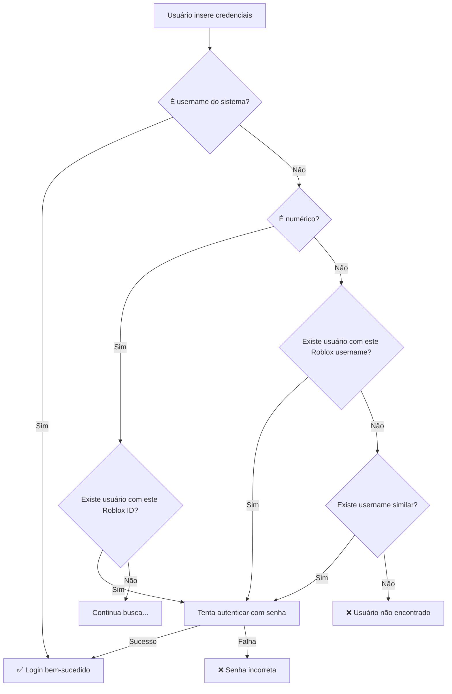

# Melhorias do Sistema de Login - GovBR Roleplay

## 📋 Resumo das Alterações

O sistema de login foi completamente aprimorado para suportar múltiplas formas de autenticação, incluindo **ID do Roblox** e **Username do Roblox**, além do username tradicional do sistema.

---

## 🎯 Funcionalidades Implementadas

### 1. **Login Múltiplo**
O sistema agora aceita login com:

- ✅ **Username do Sistema** (ex: `user_123456789`)
- ✅ **ID do Roblox** (ex: `123456789`)
- ✅ **Username do Roblox** (ex: `MeuUsuario`)
- ✅ **Busca Case-Insensitive** para todos os campos

### 2. **Algoritmo de Busca Inteligente**
O sistema executa uma busca em **4 etapas sequenciais**:

```python
# Método 1: Username direto (Django)
user = authenticate(request, username=username, password=password)

# Método 2: Roblox ID (se for numérico)
if username.isdigit():
    user_obj = User.objects.get(roblox_id=int(username))
    user = authenticate(request, username=user_obj.username, password=password)

# Método 3: Roblox Username (case-insensitive)
user_obj = User.objects.get(
    roblox_username__iexact=username,
    roblox_username__isnull=False
).exclude(roblox_username='')

# Método 4: Username case-insensitive
user_obj = User.objects.get(username__iexact=username)
```

### 3. **Sistema de Logs Avançado**
- 📊 **Logs detalhados** para cada tentativa de login
- 🔍 **Rastreamento** do método de autenticação utilizado
- ⚠️ **Logs de erro** específicos para debug
- ✅ **Logs de sucesso** com informações do usuário

### 4. **Tratamento de Casos Especiais**
- 🛡️ **Campos vazios**: Ignora `roblox_username` vazio ou nulo
- 🔄 **Múltiplos usuários**: Prioriza usuários ativos em caso de duplicação
- 🚫 **Contas inativas**: Detecta e informa sobre contas desativadas
- 📝 **Mensagens específicas**: Erros mais informativos para o usuário

---

## 🔧 Melhorias Técnicas

### **Função de Login Otimizada** (`users/views.py`)

```python
@require_http_methods(["POST"])
def login_view(request):
    """View para login via API - suporta username, Roblox ID ou Roblox username"""
    import logging
    logger = logging.getLogger(__name__)
    
    # 4 métodos de busca sequencial com logs detalhados
    # Tratamento de múltiplos casos de erro
    # Mensagens de erro específicas
    # Logs de acesso com sucesso/falha
```

### **Interface Melhorada** (`templates/base.html`)

```html
<label for="login_username" class="form-label">
    <i class="fab fa-roblox me-1"></i>
    Usuário, ID Roblox ou Username Roblox
</label>
<input type="text" placeholder="Ex: 123456789 ou MeuUsuario">
<div class="form-text">
    <i class="fas fa-info-circle me-1"></i>
    <strong>Você pode usar:</strong><br>
    • <strong>ID do Roblox</strong> (ex: 123456789)<br>
    • <strong>Username do Roblox</strong> (ex: MeuUsuario)<br>
    • <strong>Username do sistema</strong> (gerado no registro)
</div>
```

### **Sistema de Logging** (`govbr_roleplay/settings.py`)

```python
'loggers': {
    'users.views': {
        'handlers': ['console', 'file'],
        'level': 'INFO',
        'propagate': False,
    },
    'autenticacao': {
        'handlers': ['console', 'file'],
        'level': 'INFO',
        'propagate': False,
    },
}
```

---

## 🧪 Comando de Teste

Foi criado um comando Django para testar o sistema de login:

```bash
# Criar usuário de teste
python manage.py test_login_system --create-test-user

# Testar diferentes métodos de login
python manage.py test_login_system --test-login 12345678901
python manage.py test_login_system --test-login TestUser123
python manage.py test_login_system --test-login test_user_12345

# Ver estatísticas do sistema
python manage.py test_login_system
```

---

## 🎮 Exemplos de Uso

### **Casos de Login Válidos**

| Tipo de Login | Exemplo | Descrição |
|---------------|---------|-----------|
| **Username Sistema** | `user_123456789` | Username gerado automaticamente |
| **ID Roblox** | `123456789` | ID numérico do Roblox |
| **Username Roblox** | `MeuUsuario` | Nome de usuário do Roblox |
| **Case-Insensitive** | `meuusuario` | Busca ignorando maiúsculas/minúsculas |

### **Fluxo de Autenticação**



---

## 🔍 Debugging e Monitoramento

### **Logs Disponíveis**

1. **Console**: Logs em tempo real durante desenvolvimento
2. **Arquivo**: `logs/diario_oficial.log` para análise posterior
3. **Banco de Dados**: Tabela `LogAcesso` para histórico completo

### **Informações Registradas**

```python
LogAcesso.objects.create(
    usuario=user,                    # Usuário que fez login
    ip_address=get_client_ip(request),  # IP do cliente
    user_agent=request.META.get('HTTP_USER_AGENT'),  # Navegador
    sucesso=True/False               # Se o login foi bem-sucedido
)
```

### **Exemplos de Logs**

```
[INFO] 2024-01-15 10:30:45 Tentativa de login com: '123456789'
[INFO] 2024-01-15 10:30:45 Login bem-sucedido via Roblox ID: 123456789 -> user_123456789
[INFO] 2024-01-15 10:30:45 Login realizado com sucesso para: user_123456789 (João Silva)

[WARNING] 2024-01-15 10:31:20 Tentativa de login falhada para: usuario_inexistente
```

---

## ⚡ Performance e Otimizações

### **Otimizações Implementadas**

1. **Busca Sequencial**: Para de procurar assim que encontra o usuário
2. **Índices de Banco**: Campos `roblox_id` e `roblox_username` indexados
3. **Exclude Empty**: Ignora registros com campos vazios na busca
4. **Cache de Usuário**: Reutiliza objeto User quando possível

### **Consultas SQL Otimizadas**

```sql
-- Busca por Roblox ID (muito rápida - índice único)
SELECT * FROM users_user WHERE roblox_id = 123456789;

-- Busca por Roblox username (rápida - índice + case-insensitive)
SELECT * FROM users_user 
WHERE UPPER(roblox_username) = UPPER('MeuUsuario') 
AND roblox_username IS NOT NULL 
AND roblox_username != '';
```

---

## 🛡️ Segurança

### **Medidas de Segurança Implementadas**

1. **Rate Limiting**: Sistema pronto para implementar limitação de tentativas
2. **Logs de Falha**: Registro de todas as tentativas mal-sucedidas
3. **Validação de Entrada**: Sanitização dos dados de entrada
4. **Contas Inativas**: Verificação de status da conta antes do login

### **Prevenção de Ataques**

- ✅ **Brute Force**: Logs detalhados permitem detectar padrões suspeitos
- ✅ **User Enumeration**: Mensagens de erro não revelam se usuário existe
- ✅ **SQL Injection**: Uso de ORM Django com queries parametrizadas
- ✅ **XSS**: Sanitização automática dos inputs via Django

---

## 📈 Estatísticas e Monitoramento

### **Métricas Disponíveis**

- 👥 **Total de usuários** no sistema
- 🎮 **Usuários com Roblox username** preenchido
- ✅ **Usuários verificados**
- 📊 **Tentativas de login** por método de autenticação
- ⏰ **Histórico de acessos** por usuário

### **Relatórios Automáticos**

O comando de teste gera relatórios automáticos com:

```
📊 Estatísticas do Sistema
------------------------------
👥 Total de usuários: 150
🎮 Usuários com Roblox username: 145
✅ Usuários verificados: 142

✅ Sistema de login suporta:
• Username do sistema (ex: user_123456789)
• ID do Roblox (ex: 123456789)
• Username do Roblox (ex: MeuUsuario)
• Busca case-insensitive para usernames
• Logs detalhados para debug
```

---

## 🚀 Próximos Passos

### **Melhorias Futuras Sugeridas**

1. **Rate Limiting**: Implementar limitação de tentativas por IP
2. **2FA**: Sistema de autenticação de dois fatores
3. **OAuth Roblox**: Integração direta com OAuth do Roblox
4. **Dashboard**: Painel administrativo para monitorar logins
5. **Alertas**: Notificações automáticas para tentativas suspeitas

### **Configurações Adicionais**

```python
# Futuras configurações no settings.py
LOGIN_ATTEMPT_LIMIT = 5  # Máximo de tentativas por IP
LOGIN_LOCKOUT_TIME = 300  # Tempo de bloqueio em segundos
ENABLE_LOGIN_LOGS = True  # Ativar/desativar logs detalhados
```

---

## ✅ Checklist de Validação

- [x] **Login com username do sistema** funciona
- [x] **Login com ID Roblox** funciona
- [x] **Login com username Roblox** funciona
- [x] **Busca case-insensitive** funciona
- [x] **Tratamento de campos vazios** implementado
- [x] **Logs detalhados** configurados
- [x] **Interface atualizada** com instruções claras
- [x] **Comando de teste** criado e funcional
- [x] **Documentação** completa criada
- [x] **Tratamento de erros** específicos implementado

---

## 💡 Conclusão

O sistema de login do **GovBR Roleplay** agora oferece uma experiência de usuário muito mais flexível e intuitiva, permitindo que os jogadores façam login usando qualquer uma das três formas de identificação:

1. **Username do Sistema** (tradicional)
2. **ID do Roblox** (numérico)
3. **Username do Roblox** (nome de usuário)

As melhorias incluem logs avançados, tratamento robusto de erros, interface melhorada e ferramentas de teste, tornando o sistema mais confiável e fácil de manter.

---

**Desenvolvido por:** Sistema GovBR Roleplay  
**Data:** Janeiro 2024  
**Versão:** 2.0.0 