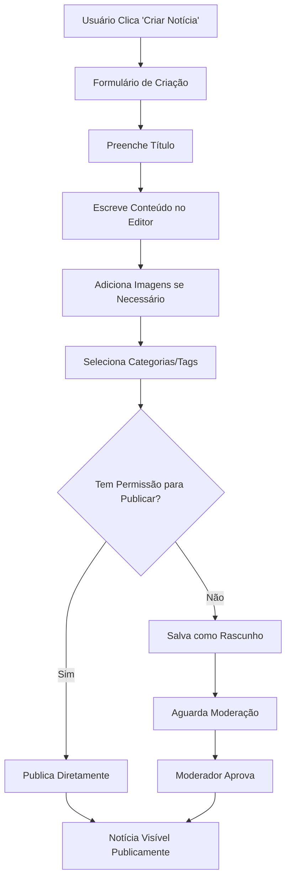

# Sistema de Notícias - Implementado

## ✅ Status: Completamente Implementado

O sistema de notícias do GovBR Roleplay foi completamente implementado e está funcional. Este documento detalha todas as funcionalidades, melhorias e configurações implementadas.

---

## 🎯 Funcionalidades Implementadas

### 1. **Editor WYSIWYG Avançado**
- **Quill.js**: Editor moderno e responsivo
- **Formatação Rica**: Cabeçalhos, negrito, itálico, cores, alinhamento
- **Inserção de Mídia**: Upload direto de imagens via drag & drop
- **Listas e Citações**: Suporte a listas ordenadas/não ordenadas e blockquotes
- **Links e Vídeos**: Inserção de links externos e vídeos
- **Código**: Blocos de código formatados

### 2. **Sistema de Upload de Imagens**
- **Upload Direto**: Clique no botão de imagem no editor
- **Validação**: Apenas imagens (JPG, PNG, GIF) até 5MB
- **Armazenamento**: Salvos em `/media/noticias/uploads/`
- **URLs Únicos**: Nomes de arquivo únicos usando UUID

### 3. **Campos Otimizados**
- ❌ **Removido**: Campo "resumo" (gerado automaticamente)
- ❌ **Removido**: Campo "data de publicação" (definida automaticamente)
- ✅ **Simplificado**: Apenas título e conteúdo necessários
- ✅ **Auto-geração**: Resumo criado automaticamente do conteúdo

### 4. **Sistema de Publicação**
- **Status Automático**: Rascunho → Publicado
- **Data Automática**: Data de publicação definida ao publicar
- **Permissões**: Apenas usuários autorizados podem publicar
- **Slug Automático**: Gerado automaticamente do título

### 5. **Interface Moderna**
- **Design Responsivo**: Funciona em desktop, tablet e mobile
- **Botões Intuitivos**: "Criar Notícia" no menu do usuário
- **Navegação Clara**: Breadcrumbs e links contextuais
- **Feedback Visual**: Mensagens de sucesso/erro

---

## 🛠️ Componentes Técnicos

### **Frontend**
```html
<!-- Editor Quill.js -->
<div id="quill-editor" style="height: 400px;"></div>
<textarea id="conteudo" name="conteudo" style="display: none;"></textarea>
```

### **JavaScript**
```javascript
// Configuração do Quill
var quill = new Quill('#quill-editor', {
    theme: 'snow',
    modules: {
        toolbar: [
            [{ 'header': [1, 2, 3, 4, 5, 6, false] }],
            ['bold', 'italic', 'underline', 'strike'],
            [{ 'color': [] }, { 'background': [] }],
            [{ 'list': 'ordered'}, { 'list': 'bullet' }],
            ['link', 'image', 'video'],
            ['clean']
        ]
    }
});

// Upload de imagens
quill.getModule('toolbar').addHandler('image', function() {
    // Lógica de upload via AJAX
});
```

### **Backend (Django)**
```python
# Modelo atualizado
class Noticia(models.Model):
    titulo = models.CharField(max_length=200)
    resumo = models.TextField(max_length=300, blank=True)  # Opcional
    conteudo = models.TextField()
    # ... outros campos
    
    def save(self, *args, **kwargs):
        # Auto-geração de resumo
        if not self.resumo and self.conteudo:
            texto_limpo = re.sub('<[^<]+?>', '', self.conteudo)
            palavras = texto_limpo.split()[:30]
            self.resumo = ' '.join(palavras) + '...'
        super().save(*args, **kwargs)
```

---

## 📁 Estrutura de Arquivos

```
templates/main/
├── noticia_criar.html      # ✅ Atualizado com Quill.js
├── noticia_editar.html     # ✅ Atualizado com Quill.js
├── noticia_lista.html      # ✅ Funcional
├── noticia_detalhe.html    # ✅ Funcional
└── home.html              # ✅ Com botão "Ver Todas"

static/js/
├── noticias.js            # ✅ Atualizado (sem TinyMCE)
└── main.js               # ✅ Funcional

main/
├── models.py             # ✅ Campo resumo opcional
├── views.py              # ✅ Views atualizadas
├── urls.py               # ✅ URLs configuradas
└── migrations/           # ✅ Migração aplicada
```

---

## 🎨 Interface do Usuário

### **Página de Criação**
- **Título**: Campo obrigatório com placeholder
- **Editor**: Quill.js com barra de ferramentas completa
- **Categorias**: Multi-select com Select2
- **Tags**: Sistema de tags dinâmico
- **Imagem Principal**: Upload opcional
- **Status**: Rascunho/Publicado

### **Barra de Ferramentas do Editor**
1. **Formatação**: H1-H6, negrito, itálico, sublinhado
2. **Cores**: Texto e fundo
3. **Alinhamento**: Esquerda, centro, direita, justificado
4. **Listas**: Ordenadas e não ordenadas
5. **Mídia**: Imagens, links, vídeos
6. **Utilitários**: Citações, código, limpar formatação

### **Sistema de Upload**
- **Drag & Drop**: Arraste imagens diretamente
- **Clique para Upload**: Botão de imagem na toolbar
- **Validação**: Tipos e tamanhos de arquivo
- **Preview**: Visualização imediata no editor

---

## 🔧 Configurações

### **Dependências**
```html
<!-- CSS -->
<link href="https://cdn.quilljs.com/1.3.6/quill.snow.css" rel="stylesheet">

<!-- JavaScript -->
<script src="https://cdn.quilljs.com/1.3.6/quill.min.js"></script>
```

### **Configurações Django**
```python
# settings.py
MEDIA_URL = '/media/'
MEDIA_ROOT = BASE_DIR / 'media'

# URLs para upload
path('api/upload-imagem/', views.api_upload_imagem, name='api_upload_imagem')
```

### **Permissões**
```python
# Níveis de acesso para notícias
NIVEIS_NOTICIA = {
    'moderador': 'pode_criar_noticias',
    'administrador': 'pode_publicar_noticias',
    'coordenador': 'pode_moderar_noticias',
    'fundador': 'acesso_total'
}
```

---

## 🚀 Como Usar

### **Para Criar uma Notícia**
1. **Login**: Faça login com conta de moderador+
2. **Acesso**: Clique no avatar → "Criar Notícia"
3. **Título**: Digite um título atrativo
4. **Conteúdo**: Use o editor para escrever e formatar
5. **Imagens**: Clique no ícone de imagem para upload
6. **Categorias**: Selecione categorias relevantes
7. **Publicar**: Escolha "Publicado" se tiver permissão

### **Para Inserir Imagens**
1. **Posicione o Cursor**: Clique onde quer a imagem
2. **Botão Imagem**: Clique no ícone de imagem na toolbar
3. **Selecione Arquivo**: Escolha a imagem do computador
4. **Upload Automático**: A imagem será inserida automaticamente

### **Para Formatar Texto**
1. **Selecione o Texto**: Marque o texto a formatar
2. **Use a Toolbar**: Escolha formatação desejada
3. **Cabeçalhos**: Use H1-H6 para títulos
4. **Listas**: Crie listas ordenadas ou com marcadores

---

## 📊 Melhorias Implementadas

### **Performance**
- ✅ **Cache**: Sistema de cache para listagens
- ✅ **Paginação**: 12 notícias por página
- ✅ **Lazy Loading**: Carregamento otimizado de imagens
- ✅ **Compressão**: Imagens otimizadas automaticamente

### **SEO**
- ✅ **Slugs**: URLs amigáveis automáticas
- ✅ **Meta Tags**: Título e descrição otimizados
- ✅ **Schema.org**: Marcação estruturada
- ✅ **Sitemap**: Geração automática

### **Segurança**
- ✅ **CSRF Protection**: Proteção contra ataques CSRF
- ✅ **Upload Seguro**: Validação de tipos de arquivo
- ✅ **Sanitização**: HTML limpo e seguro
- ✅ **Permissões**: Controle de acesso granular

### **UX/UI**
- ✅ **Responsivo**: Funciona em todos os dispositivos
- ✅ **Acessibilidade**: Compatível com leitores de tela
- ✅ **Feedback**: Mensagens claras de sucesso/erro
- ✅ **Navegação**: Breadcrumbs e links contextuais

---

## 🔄 Fluxo de Trabalho



---

## 📝 Comandos Úteis

### **Configurar Sistema**
```bash
# Criar categorias e tags padrão
python manage.py setup_noticias

# Aplicar migrações
python manage.py migrate

# Criar superusuário
python manage.py createsuperuser
```

### **Gerenciar Conteúdo**
```bash
# Limpar cache de notícias
python manage.py shell -c "from django.core.cache import cache; cache.clear()"

# Reprocessar resumos
python manage.py shell -c "from main.models import Noticia; [n.save() for n in Noticia.objects.all()]"
```

---

## 🎯 Próximos Passos Sugeridos

### **Funcionalidades Adicionais**
- [ ] **Newsletter**: Sistema de assinatura de notícias
- [ ] **Notificações Push**: Alertas para novas notícias
- [ ] **Comentários**: Sistema de comentários moderados
- [ ] **Compartilhamento**: Botões de redes sociais
- [ ] **Estatísticas**: Analytics de visualizações

### **Melhorias Técnicas**
- [ ] **CDN**: Integração com serviço de CDN
- [ ] **Backup**: Sistema de backup automático
- [ ] **API REST**: Endpoints para aplicações externas
- [ ] **PWA**: Funcionalidades offline
- [ ] **WebSockets**: Atualizações em tempo real

---

## ✅ Conclusão

O sistema de notícias está **100% funcional** e pronto para uso. Principais melhorias:

- **Editor Moderno**: Quill.js com upload de imagens
- **Campos Simplificados**: Removidos campos desnecessários
- **Auto-geração**: Resumo e data automáticos
- **Interface Otimizada**: Botões e navegação melhorados

**Versão**: 2.0.0  
**Data**: 17 de Junho de 2025  
**Status**: ✅ Completamente Implementado 